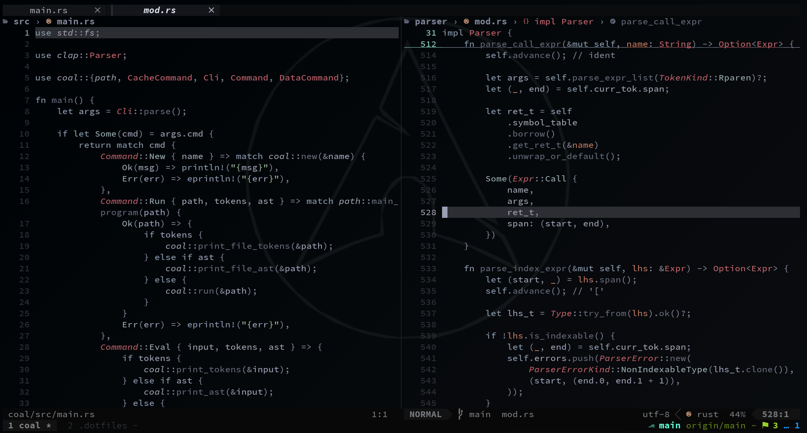
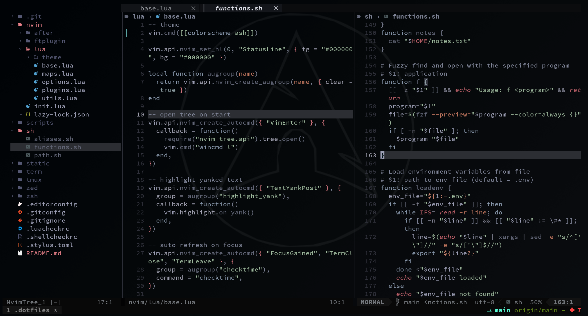

# Ash

A dark theme for Neovim.




## Installation

Using [lazy.nvim](https://github.com/folke/lazy.nvim) or your preferred package manager:

```lua
{ "drewxs/ash.nvim" }
```

## Configuration

Options can be found in [`lua/ash/options.lua`](lua/ash/options.lua).

---

Credits for code structure / inspo: [Catppuccin](https://github.com/catppuccin/nvim)

[License](LICENSE), [License-MIT](LICENSE-MIT)
